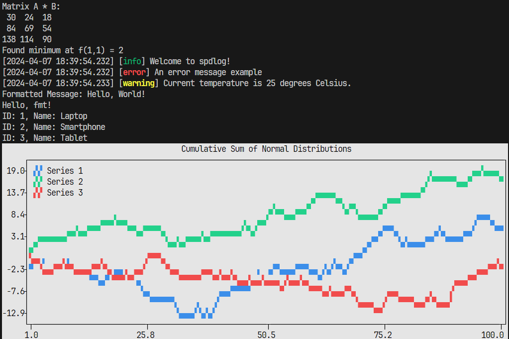

# CPP Starter



This is a starter project designed for Windows/Linux C++ cross-platform development. It uses CMake for configuring/building and vcpkg manifest for dependency management. The structure is Dockerized for Linux, ensuring deterministic builds. It is highly recommended to use it with VSCode Remote-Containers. It is also compatible with Visual Studio on Windows as a CMake project. See the caveats section for a windows debug quirk.

It is worth mentioning that this project somewhat oriented toward data science type workflow. Meaning you have the ability to plot inside the terminal and you have the ability to work with data with SQL using DuckDB.

## Prerequisites

- [CMake](https://cmake.org/download/) for building the project
- [vcpkg](https://github.com/microsoft/vcpkg) for managing C++ libraries
- [Docker](https://www.docker.com/get-started) for containerization (required for Linux)
- [Visual Studio Code](https://code.visualstudio.com/) with the [Remote - Containers extension](https://code.visualstudio.com/docs/remote/containers) for development
- [Python](https://www.python.org/) for plotting.

## Caveats

On Windows in Debug configuration, the project will compile but DuckDB calls will crash the program at runtime. Seems to be an issue with DuckDB. 

Building DuckDB libraries in the docker container takes quite a while. If you are not using DuckDB in your workflow, removing it will drastically improve docker container build times.

## Getting Started on Linux

To get started, clone the repository to your local machine using your preferred method.

### Configuration

Before building the project, you need to configure it with the dependencies. Run the following script to configure the project:

```sh
./scripts/configure.sh
```

This script will set up the necessary configurations for building the project.

### Building the Project

To build the project, execute:

```sh
./scripts/build.sh
```

This will compile the project and generate the required executables.

### Running the Project

After building the project, you can run the main console application using:

```sh
./scripts/run.sh
```

This script executes the compiled `console` executable.

### Running Tests

To ensure your build passes all the tests, use the following command:

```sh
./scripts/run_tests.sh
```

This will execute the test suite defined in the project.

### Cleaning Build Artifacts

If you need to clean the build directory to start a fresh build, simply run:

```sh
./scripts/clean.sh
```

This script will delete the `build` directory, removing all compiled binaries and artifacts.

## Docker and VSCode Remote Containers

The project is ready to be used with Docker, especially when working on Linux. A `Dockerfile` is provided to create a development environment consistent across any platform.

For a smooth development experience in VSCode, open the repository in a Remote Container. This will ensure all dependencies and toolchains are set up exactly as they should be, regardless of your host system.

## Getting Started on Windows

If you have a relatively recent version of Microsoft Visual Studio, it will be able to work with CMake projects. Also, you need to have vcpkg installed on your machine. Simply open up the project folder in Visual Studio, and it will be able to work with it.

## CUDA (not tested on Linux)

There is a CUDA sample that can be compiled. The CUDA toolkit needs to be installed and discoverable by find_package. The WITH_CUDA variable can be set in the CMakeSettings.json file. This has not been tested on Linux.

## In-Terminal Plotting

The terminal plots are generated by calling a Python library called Plotext. The CMake project sets up the virtual env and installs the prerequisite libraries. The mechanism involves the C++ program saving plotting data as a Protobuf serialized file on disk. Then making a system call to Python scripts and providing the path to this serialized file as a command line argument.

You can simply write your own Python plotting scripts, also define the Protobuf templates as needed, which should make additional plotting options quite easy.

## Cross-Platform Compatibility

The project is designed to be cross-platform, compatible with both Windows and Linux. All scripts and code are prepared to be run on either operating system with no modifications needed.

If you see the following error while configuring the project on Windows:

```
Severity	Code	Description	Project	File	Line	Suppression State	Details
Error		CMake Error at C:/vcpkg/scripts/buildsystems/vcpkg.cmake:899 (message):
  vcpkg install failed.  See logs for more information:
  C:\path\to\project\cpp_starter\build\x64-win-debug\vcpkg-manifest-install.log		C:/vcpkg/scripts/buildsystems/vcpkg.cmake	899		
```

Your vcpkg is likely out of date. Go to your vcpkg directory and do a `git fetch`.


## License

Distributed under the MIT License. See `LICENSE` for more information.

